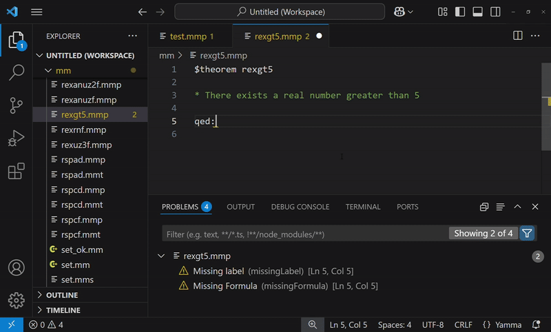

# Yamma

***Y***amma's ***a*** ***M***eta***m***ath proof ***a***ssistant for Visual Studio Code.

A language server for .mmp files (metamath proof files).

## Features

- **Completions**: syntax suggestions, step suggestions, search results

- **Diagnostics**
- **Code Actions**
- **Quick Fixes**: missing disjoint vars statements
- **Semantic Tokenization**
- **On Hover Documentation**
- **Unification**: standard reformatting, renumbering, step completion, step derivation
- **Search** in the theory
- **Step Suggestions** (Model Based)
- **Model Generation**
- **Proof Generation**
- **Load/Save additional** theorems in .mm compatible format

## Installation

1. Launch Visual Studio Code.
2. Go to the Extensions view by clicking on the square icon on the left sidebar or pressing `Ctrl+Shift+X`.
3. Search for "Yamma" in the search bar.
4. Click on the "Install" button next to the "Yamma" extension.
5. After the installation, click on the "Reload" button to activate the extension.

## Usage

1. Open a .mmp file in Visual Studio Code
2. If a file set.mm is found in the same folder, the extension will automatically use it as the underlying theory: it will be loaded, parsed, and verified
3. If no .mm file is automatically found, click on the Gear icon next to the extension's name and select Extension Settings from the dropdown menu. This action opens the settings for Yamma: here you can insert the exact path to the .mm file to be used
4. Use the command palette (`Ctrl+Shift+P` or `Cmd+Shift+P` on macOS) to access the available commands and features provided by the extension
5. Utilize the Intellisense capabilities to get suggestions while writing your proofs
6. Once your proof is complete, you can use the "Unify and store in MMT folder" contextual menu command to generate an MMT file, ready to be copied and pasted into your main MM file.

Yamma provides the following keyboard commands (on a Mac we may need to use the command key rather than the CTRL key):

* CTRL+U Unify
* CTRL+H Search

