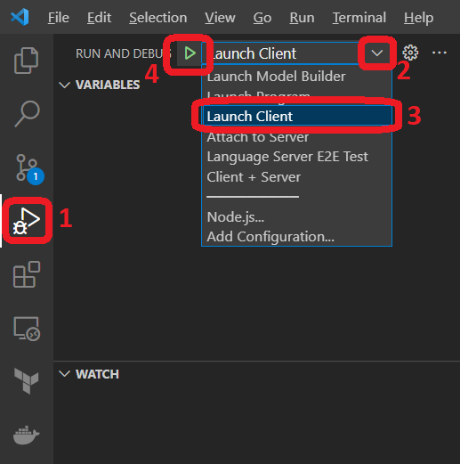
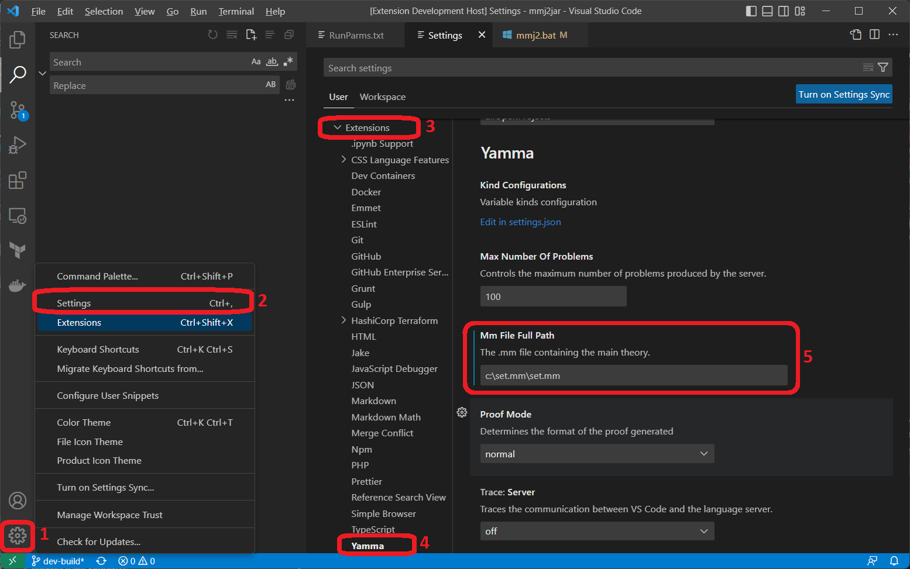

# Yamma

***Y***amma's ***a*** ***M***eta***m***ath proof ***a***ssistant for Visual Studio Code.

A language server for .mmp files (metamath proof files).

## Features

- **Completions**: syntax suggestions, step suggestions, search results
- **Diagnostics**
- **Code Actions**
- **Quick Fixes**: missing disjoint vars statements
- **Semantic Tokenization**
- **On Hover Documentation**
- **Unification**: standard reformatting, renumbering, step completion, step derivation
- **Search** in the theory
- **Step Suggestions** (Model Based)
- **Model Generation**
- **Proof Generation**
- **Load/Save additional** theorems in .mm compatible format

## Prerequisites

To use this extension, you need to have Node.js installed on your machine. If Node.js is not yet installed, follow the official installation guide: [Node.js Installation Guide](https://nodejs.org).

## Installation

1. Launch Visual Studio Code.
2. Go to the Extensions view by clicking on the square icon on the left sidebar or pressing `Ctrl+Shift+X`.
3. Search for "Yamma" in the search bar.
4. Click on the "Install" button next to the "Yamma" extension.
5. After the installation, click on the "Reload" button to activate the extension.

## Usage

1. Open a .mmp file in Visual Studio Code
2. If a file set.mm is found in the same folder, the extension will automatically use it as the underlying theory: it will be loaded, parsed, and verified
3. If no .mm file is automatically found, click on the Gear icon next to the extension's name and select Extension Settings from the dropdown menu. This action opens the settings for Yamma: here you can insert the exact path to the .mm file to be used
4. Use the command palette (`Ctrl+Shift+P` or `Cmd+Shift+P` on macOS) to access the available commands and features provided by the extension
5. Utilize the Intellisense capabilities to get suggestions while writing your proofs

## Contribute

First, please ensure you have git, Node.js, and Visual Studio Code installed.  Then:

```
	git clone https://github.com/glacode/yamma.git
	cd yamma
	npm install
	code .
```
The final command opens Visual Studio Code, within it, we can:


1. From the sidebar on the far left, choose "Run and Debug".
2. Open the Run and Debug drop-down.
3. Choose "Launch Client" from the drop-down.
4. Press the play icon ("Start Debugging").

This runs a second instance of Visual Studio Code.  This instance is running the Yamma extension.  The first time in here, we will want to open the settings and set a path to a valid .mm file.


1. From the sidebar on the far left, choose "Manage".
2. From the menu this brings up, choose "Settings".
3. From the bottom of the list of settings, expand "Extensions".
4. From the list of extensions, click on "Yamma"
5. In the "Mm File Full Path" box, enter the full path to a valid .mm file.

Now when we have a .mmp file open in this instance of Visual Studio Code, Yamma provides the following keyboard commands (on a Mac we may need to use the command key rather than the CTRL key):

* CTRL+U Unify
* CTRL+H Search

